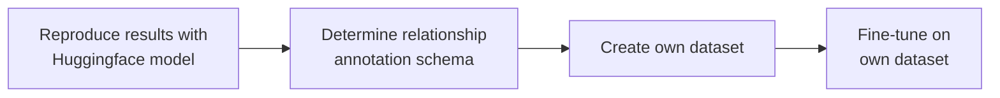

# Seq2rel: generative relationship extraction 
This repository employs the seq2rel method from the paper ["A sequence-to-sequence approach for document-level relation extraction"](http://arxiv.org/abs/2204.01098) to extract relationships between chemicals and adverse outcomes described in scientific literature. Although the project was eventually discontinued, the following outlines the outcomes and current status:

The project's ultimate objective was to utilize the generative relationship extraction method described in the [paper](http://arxiv.org/abs/2204.01098) to extract and label relationships between chemicals and adverse outcomes. The notable advantage of this method is its ability to express discontinuous mentions, coreferent mentions, and N-ary relationships.

img

The plan for this project was as follows:

1. Reproduce the results of the paper by fine-tuning a Huggingface model on the same dataset.
2. Create a dataset matching the desired relationship annotation schema.
3. Determine the relationship annotation schema, potentially using [Ensemble Biclustering (EBC)](https://pubmed.ncbi.nlm.nih.gov/26219079/). EBC would identify different relationship groups within the corpus for manual labeling.
4. Train the model on this new dataset.


---

The status of the project at the time of discontinuation was the completion of reproducing results with a Huggingface model. Specifically, two training scripts were created to train a [google/T5]((https://huggingface.co/docs/transformers/model_doc/t5)) model on the [CDR dataset in seq2rel format](https://github.com/JohnGiorgi/seq2rel-ds). The first training script ([run.py](https://github.com/ontox-hu/Generative-re-tests/blob/main/run.py)) was implemented using [sacred](https://github.com/IDSIA/sacred) to enhance experiment reproducibility, although it didn't closely follow Huggingface programming conventions. The second training script ([run_ds.py](https://github.com/ontox-hu/Generative-re-tests/blob/main/run_ds.py)) enabled distributed training with [Deepspeed](https://github.com/microsoft/DeepSpeed).

Due to the novel output of the models, a custom evaluation method was necessary. This method needed to convert text structured according to the annotation schema into relationship triples, accounting for coreferent mentions. The method works for relationship extraction, but entity recognition measures are still suboptimal. The evaluation method is defined in [this script](https://github.com/ontox-hu/Generative-re-tests/blob/main/gen_re_eval.py) and is explained and tested in [this notebook](https://github.com/ontox-hu/Generative-re-tests/blob/main/notebooks/testing_evaluation.ipynb).

The results after fine-tuning on the CDR dataset:
| Date | script | Model | RE Precision | RE Recall | RE F1-score | unstructerd |
|------|--------|-------|--------------|-----------|-------------|-------------|
| 04-03-2024 | run.py | t5-large | 28.86% | 27.54% | 28.18% | 4.2% | 
| 14-04-2024 | run.py | t5-3b    | 74.71% | 74.71% | 69.41% | 2.6% |
| 16-05-2024 | run_ds.py | t5-11b | 77.78% | 38.89% | 51.85% | 98.24% |


Note:
- The results from the model trained on 03-04-2024 are inaccurate due to bugs in the evaluation method at the time of testing, which deflated the scores.
- The results from the model trained on 05-16-2024 are also inaccurate. During evaluation, the model could only produce output with a maximum length of 20 tokens, leading to lower than expected scores. The correct scores were noted in a SURF directory, but at the time of writing I am  unable to access it.

---
# installation:

During the project two enviroments were used. A pip enviroment and a Conda enviroment, this is due to the fact that to make use of [Deepspeed]() a conda enviroment had to be made. 

## recreating pip enviroment

Create environment: 
```
python -m venv venv
```

Install torch manually [according to the installation guide](https://pytorch.org/get-started/locally/)
```
pip install torch
```

Copy environment 
```
pip install -r requirements.txt
```

## Recreating Conda enviroment (recomanded)

Due to Conda sometimes installing platform specific packages two environment files are availible:
- `environment.yml`
- `environment_cross_platoform.yml`

Create environment:
```
conda env create -f environment.yml
```

# Usage

The repository has two training scripts: `run.py` and `run_ds.py`. `run.py` was the initial script, it has an implementation of [sacred](https://github.com/IDSIA/sacred) which makes the experiments more reproducible. The information of these experiments can be found in [sacred_runs](https://github.com/ontox-hu/Generative-re-tests/tree/main/sacred_runs). At the end of this line of experiments [DeepSpeed](https://github.com/microsoft/DeepSpeed) was being implemented. To make use of [DeepSpeed](https://github.com/microsoft/DeepSpeed) `run_ds.py` was created. run_ds.py is a modified version of this [example huggingface training script](https://github.com/huggingface/transformers/blob/main/examples/pytorch/translation/run_translation.py).


## Without Deepspeed (but with sacred)

The repository holds the code to fine-tune a huggingface seq2seq model. You can fine-tune a model by using the following command:

```
python run.py
```

this will start the training loop and train according to the config file defined in `run.py`.

you can also define a config file on the commandline:

```
python run.py with path/to/config.yaml
```

used configs:
- [config_T5-L_cdr.yaml](https://github.com/ontox-hu/Generative-re-tests/blob/main/config/config_T5-L_cdr.yaml)
- [config_T5-3b_cdr.yaml](https://github.com/ontox-hu/Generative-re-tests/blob/main/config/config_T5-3b_cdr.yaml)

The code makes use of the [sacred](https://github.com/IDSIA/sacred) module. This is a module that automaticly saves information about each run, making the experiments more reproducible. 

this means `run.py` has all the features of a sacred experiment:
you can see some of it's functionallity:
```
python run.py --help
```

and you could print the config:
```
python run.py print_config
```

## With Deepspeed

```
deepspeed run_ds.py path/to/config.yaml
```

used configs:
- [config_T5-11b_cdr_ds.yaml](https://github.com/ontox-hu/Generative-re-tests/blob/main/config/config_T5-11b_cdr_ds.yaml)
