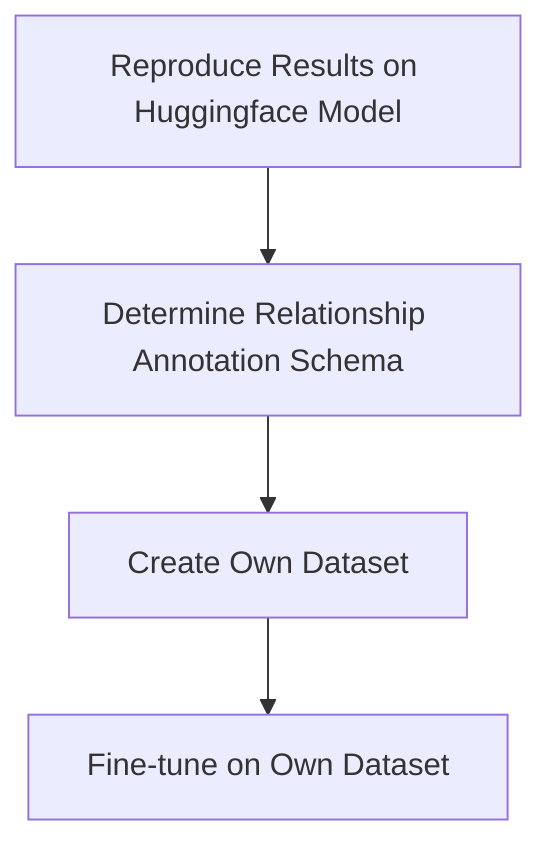

# Seq2rel
This repository uses the seq2rel method of the paper [A sequence-to-sequence approach for document-level relation extraction](http://arxiv.org/abs/2204.01098) to extract relationships between chemicals and adverse outcomes described in scientific literature. This project was eventually discontinued, in the possibility of picking back up these are the outcomes and current status of the project:

The end goal of the project was to use the generative relationship extraction method described in the [paper](http://arxiv.org/abs/2204.01098) to extract and label relationships between chemical and adverse outcomes. The notable adventage of this method is that it's able to express discontinous mentions, coferent mentions and N-ary relationships.

img

The plan of this project was to first reproduce the results of the [paper](http://arxiv.org/abs/2204.01098) by fine-tuning a Huggingface model on the same dataset. Then a dataset would be made that would match the relationship annotation schema that we want to use. A possible method to determine the relationship annationschema was to use [Ensemble Biclustering (EBC)](https://pubmed.ncbi.nlm.nih.gov/26219079/). EBC would show the different relationship groups within the corpus that can then be manually labeled. After the datasets completion the model would be trained on this new dataset.  



The status of this project when it was discontinued was that it was at the end of reproducing the results with a huggingface model. More specificly, Two training script were made that could train a [google/T5](https://huggingface.co/docs/transformers/model_doc/t5) model on the [CDR dataset in seq2rel format](https://github.com/JohnGiorgi/seq2rel-ds). The first training script ([run.py](https://github.com/ontox-hu/Generative-re-tests/blob/main/run.py)) was implented using [sacred](https://github.com/IDSIA/sacred) to make the experiments more reproducible, but didn't closely follow huggingface programming convention. The second training script ([run_ds.py](https://github.com/ontox-hu/Generative-re-tests/blob/main/run_ds.py)) was made to enable distributed training with [Deepspeed](https://github.com/microsoft/DeepSpeed). 

Because the models output was quite novel a custom evaluation method needed to be made. This method needed to go from text structerd according to the annotation schema to relationship triples, while taking into account coferent mentions. The status on this is that the method works for relationschip extraction but the measures for entity recognition still fall out to low. The evaluation method is defined in [this script](https://github.com/ontox-hu/Generative-re-tests/blob/main/gen_re_eval.py) and explained and tested in [this notebook](https://github.com/ontox-hu/Generative-re-tests/blob/main/notebooks/testing_evaluation.ipynb).

The results after fine-tuning on the CDR dataset:
| Date | script | Model | RE Precision | RE Recall | RE F1-score | unstructerd |
|------|--------|-------|--------------|-----------|-------------|-------------|
| 04-03-2024 | run.py | t5-large | 28.86% | 27.54% | 28.18% | 4.2% |

---
# installation:

Create environment: 
```
python -m venv venv
```

Install torch manually [according to the installation guide](https://pytorch.org/get-started/locally/)
```
pip install torch
```

Copy environment 
```
pip install -r requirements.txt
```
# Use
The repository holds the code to fine-tune a huggingface seq2seq model. You can fine-tune a model by using the following command:

```
python run.py
```

this will start the training loop and train according to the config file defined in `run.py`.

The code makes use of the [sacred](https://github.com/IDSIA/sacred) module. This is a module that automaticly saves information about each run, making the experiments more reproducible. 

this means `run.py` has all the features of a sacred experiment:
you can see some of it's functionallity:
```
python run.py --help
```

and you could print the config:
```
python run.py print_config
```

## Backup Script
This Bash script is designed to automate the backup process for directories containing checkpoints and sacred runs. It takes two arguments: run_time and sacred_run_number, and performs the following actions:

1. **Clear Cache**: Clears the cache directory (`~/.cache`) on an Ubuntu system to ensure that cached data does not interfere with the backup process.

2. **Copy Checkpoints**: Scans the directory `Generative-re-tests/results` for directories named according to the convention "checkpoint-****". Copies any found directories to the designated checkpoint directory (`data/generative_re_model_storage_azure/<sacred_run_number>/checkpoints`).

3. **Copy Latest Sacred Run**: Checks the directory `Generative-re-tests/sacred_runs` for the most recently created directory with a name matching sacred_run_number. If found, copies it to `data/generative_re_model_storage_azure/<sacred_run_number>`.

4. **Report**: Prints a report at the end of the script, indicating the number of iterations, directories copied, and the total time elapsed.

### Usage
```
./backup_script.sh <run_time> <sacred_run_number>
```
- <run_time>: The duration (in seconds) for which the script should run.
- <sacred_run_number>: The identifier for the sacred run to be backed up.

---
# Installed packages:
- torch
- transformers
- accelerate
- datasets
- evaluate
- rouge_score
- sentencepiece
- protobuf
- ipykernel
- wasabi
- sacred
